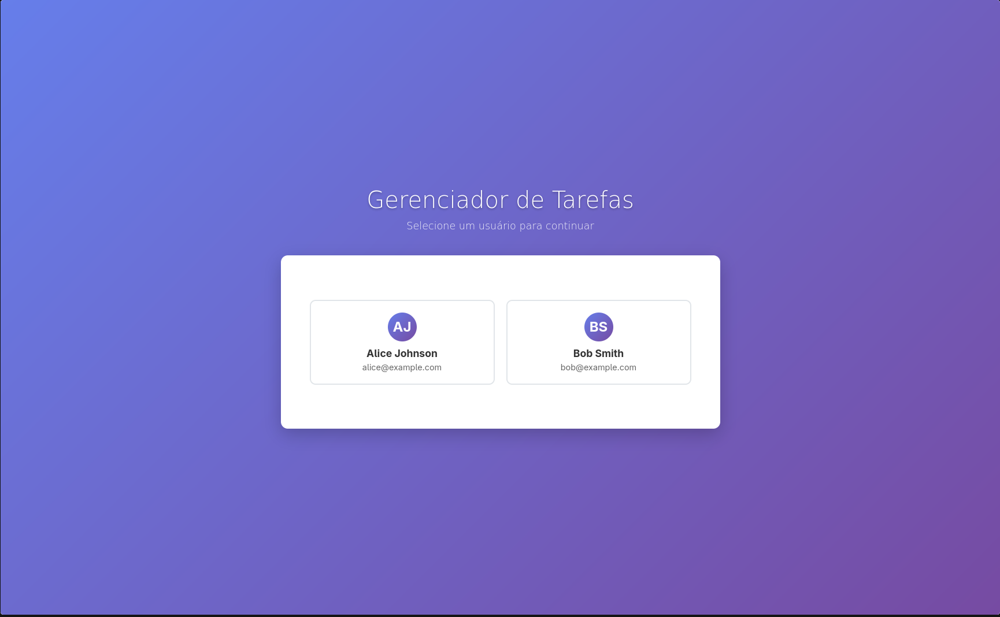
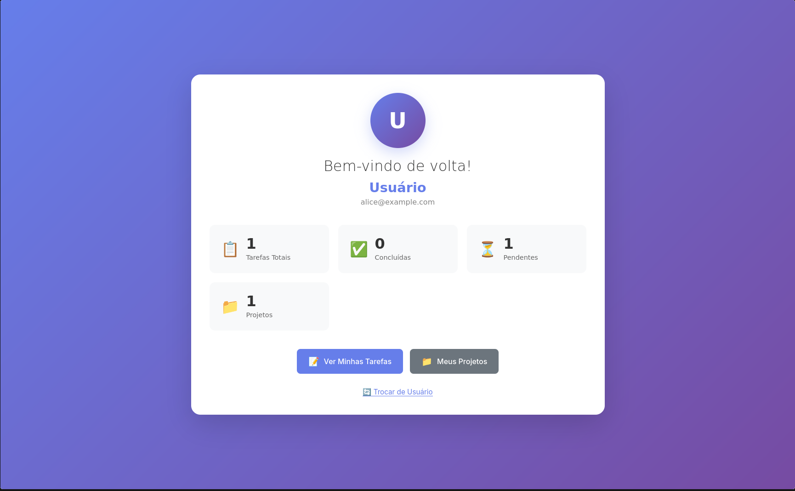
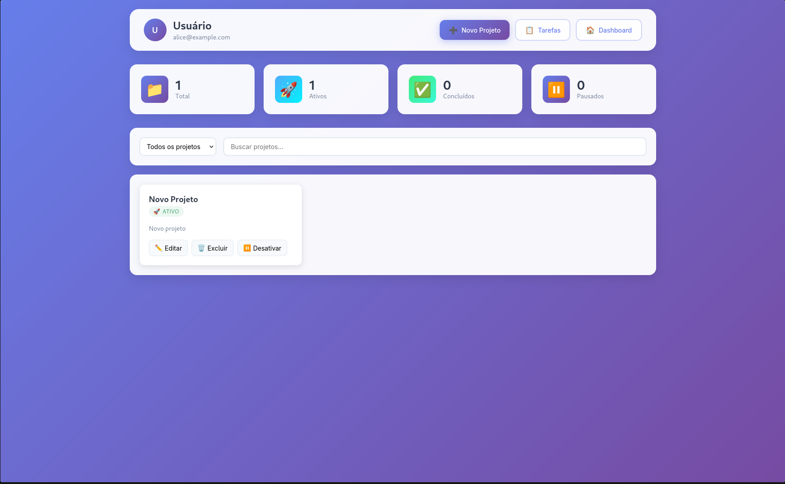

# <a name="c1"></a>1. Introdução

**Gerenciador de Tarefas** é uma aplicação web desenvolvida para facilitar o controle e organização de tarefas diárias. Este sistema permite que usuários criem, visualizem, editem e excluam tarefas, além de marcar seu status como concluído ou pendente. A aplicação conta com autenticação de usuários e persistência de dados via PostgreSQL.

O projeto é construído utilizando tecnologias modernas de desenvolvimento web, com uma arquitetura MVC (Model-View-Controller) dividida entre frontend e backend, e integra serviços de banco de dados de forma simples e escalável.

## Funcionalidades

- **CRUD de Usuários:** Sistema completo de gerenciamento de usuários com validação de dados
- **CRUD de Projetos:** Permite criar, ler, atualizar e excluir projetos associados a usuários
- **CRUD de Tarefas:** Permite criar, ler, atualizar e excluir tarefas com prioridades e vencimentos
- **Gerenciamento de Status:** Possibilidade de marcar tarefas como concluídas ou pendentes
- **Sistema de Prioridades:** Classificação de tarefas por prioridade (baixa, media, alta, urgente)
- **Associação Projeto-Tarefa:** Tarefas podem ser vinculadas a projetos específicos
- **Validação de Dados:** Validação robusta usando Joi
- **Interface Web:** Views EJS para interação com o usuário

## Tecnologias Utilizadas

- **Frontend:** HTML, CSS, JavaScript, EJS (template engine)
- **Backend:** Node.js com Express seguindo arquitetura MVC
- **Banco de Dados:** PostgreSQL
- **Validação:** Joi para validação de dados
- **Testes:** Jest e Supertest
- **Ambiente:** dotenv para gerenciamento de variáveis

# <a name="c2"></a>2. Banco de Dados

O sistema utiliza o **PostgreSQL** como banco de dados relacional. O banco de dados é responsável por armazenar todas as informações relacionadas aos usuários, projetos e tarefas, garantindo persistência e integridade dos dados através de relacionamentos bem definidos.

A estrutura de dados foi projetada seguindo boas práticas de modelagem relacional para atender às funcionalidades do sistema de gerenciamento de tarefas, permitindo operações de leitura e escrita com desempenho e segurança.

## Estrutura das Tabelas

### Tabela `users`

Armazena informações dos usuários do sistema:

- **id** (SERIAL PRIMARY KEY) - Identificador único
- **full_name** (VARCHAR) - Nome completo do usuário
- **username** (VARCHAR) - Nome de usuário único
- **profession** (VARCHAR) - Profissão do usuário
- **password_hash** (VARCHAR) - Hash da senha
- **email** (VARCHAR UNIQUE) - Email único do usuário
- **is_active** (BOOLEAN) - Status ativo/inativo

### Tabela `projects`

Armazena informações dos projetos:

- **id** (SERIAL PRIMARY KEY) - Identificador único
- **project_name** (VARCHAR NOT NULL) - Nome do projeto
- **description** (TEXT) - Descrição detalhada
- **project_status** (VARCHAR) - Status: ativo, pausado, concluído, cancelado
- **is_active** (BOOLEAN) - Status ativo/inativo
- **user_id** (INTEGER FOREIGN KEY) - Referência ao usuário proprietário

### Tabela `tasks`

Armazena informações das tarefas:

- **id** (SERIAL PRIMARY KEY) - Identificador único
- **task_name** (VARCHAR NOT NULL) - Nome da tarefa
- **task_description** (TEXT) - Descrição detalhada
- **due_date** (DATE) - Data de vencimento (opcional)
- **due_time** (TIME) - Horário de vencimento (opcional)
- **has_notification** (BOOLEAN) - Se deve notificar próximo ao vencimento
- **task_priority** (VARCHAR) - Prioridade: baixa, media, alta, urgente
- **is_completed** (BOOLEAN) - Status de conclusão
- **project_id** (INTEGER FOREIGN KEY) - Referência ao projeto (opcional)
- **user_id** (INTEGER FOREIGN KEY) - Referência ao usuário proprietário

## Relacionamentos

- Um usuário pode ter múltiplos projetos (1:N)
- Um usuário pode ter múltiplas tarefas (1:N)
- Um projeto pode ter múltiplas tarefas (1:N)
- Uma tarefa pode ou não estar associada a um projeto

A integração com o banco de dados é feita através de queries SQL nativas no backend Node.js via módulo `pg`, garantindo acesso seguro e controlado aos dados.


---

# <a name="c3"></a>3. Uso da API

A aplicação expõe uma API RESTful para gerenciar usuários, projetos e tarefas. Todos os endpoints estão disponíveis sob o caminho base `/api/` e trabalham com requisições e respostas no formato JSON.

## 3.1. Usuários

### Endpoints Principais

- **GET /api/users** – Lista todos os usuários
- **POST /api/users** – Cria um novo usuário
- **GET /api/users/:id** – Detalha um usuário específico
- **PUT /api/users/:id** – Atualiza um usuário
- **DELETE /api/users/:id** – Remove um usuário
- **GET /api/users-totals** – Estatísticas de usuários

### Exemplo de Criação de Usuário

```json
{
  "full_name": "João Silva",
  "username": "joaosilva",
  "email": "joao@exemplo.com",
  "profession": "Desenvolvedor",
  "password_hash": "hash_da_senha",
  "is_active": true
}
```

## 3.2. Projetos

### Endpoints Principais

- **GET /api/users/:userId/projects** – Lista projetos do usuário
- **POST /api/users/:userId/projects** – Cria um novo projeto
- **GET /api/users/:userId/projects/:id** – Detalha um projeto
- **PUT /api/users/:userId/projects/:id** – Atualiza um projeto
- **DELETE /api/users/:userId/projects/:id** – Remove um projeto

### Exemplo de Criação de Projeto

```json
{
  "project_name": "Sistema E-commerce",
  "description": "Desenvolvimento de loja virtual completa",
  "project_status": "ativo",
  "is_active": true,
  "user_id": 1
}
```

### Status Válidos para Projetos

- `ativo` - Projeto em andamento
- `pausado` - Projeto temporariamente suspenso
- `concluído` - Projeto finalizado
- `cancelado` - Projeto cancelado

## 3.3. Tarefas

### Endpoints Principais

- **GET /api/users/:userId/tasks** – Lista tarefas do usuário
- **POST /api/users/:userId/tasks** – Cria nova tarefa
- **GET /api/users/:userId/tasks/:taskId** – Detalha uma tarefa
- **PUT /api/users/:userId/tasks/:taskId** – Atualiza uma tarefa
- **DELETE /api/users/:userId/tasks/:taskId** – Remove uma tarefa
- **PATCH /api/users/:userId/tasks/:taskId/complete** – Marca como concluída
- **PATCH /api/users/:userId/tasks/:taskId/incomplete** – Marca como não concluída

### Exemplo de Criação de Tarefa

```json
{
  "task_name": "Implementar sistema de login",
  "task_description": "Criar autenticação com JWT e validação",
  "due_date": "2025-07-15",
  "due_time": "14:30",
  "has_notification": true,
  "task_priority": "alta",
  "is_completed": false,
  "project_id": 1,
  "user_id": 1
}
```

### Prioridades Válidas para Tarefas

- `baixa` - Prioridade baixa
- `media` - Prioridade média
- `alta` - Prioridade alta
- `urgente` - Prioridade urgente

## 3.4. Exemplos com curl

### Criar um usuário:

```bash
curl -X POST http://localhost:3000/api/users \
     -H "Content-Type: application/json" \
     -d '{
       "full_name":"Maria Santos",
       "username":"mariasantos",
       "email":"maria@exemplo.com",
       "profession":"Designer",
       "password_hash":"hash123"
     }'
```

### Criar um projeto para o usuário ID 1:

```bash
curl -X POST http://localhost:3000/api/users/1/projects \
     -H "Content-Type: application/json" \
     -d '{
       "project_name":"E-commerce",
       "description":"Loja virtual completa",
       "project_status":"ativo",
       "user_id":1
     }'
```

### Criar uma tarefa para o usuário ID 1:

```bash
curl -X POST http://localhost:3000/api/users/1/tasks \
     -H "Content-Type: application/json" \
     -d '{
       "task_name":"Design da homepage",
       "task_description":"Criar mockup da página inicial",
       "task_priority":"alta",
       "project_id":1,
       "user_id":1
     }'
```

### Marcar uma tarefa como concluída:

```bash
curl -X PATCH http://localhost:3000/api/users/1/tasks/1/complete
```

### Listar projetos de um usuário:

```bash
curl http://localhost:3000/api/users/1/projects
```

## 3.5. Rotas de Views

O sistema também possui rotas para renderização de views EJS com interface moderna e intuitiva:

### **GET /** – Página Principal (main.ejs)

Tela inicial do sistema onde o usuário seleciona seu perfil para acessar a aplicação.



_Figura 1: Tela de seleção de usuário - Interface principal do Gerenciador de Tarefas_

### **GET /users/:id** – Dashboard do Usuário (welcome.ejs)

Página de boas-vindas com visão geral das estatísticas do usuário, incluindo contador de tarefas totais, concluídas, pendentes e projetos. Oferece navegação rápida para as funcionalidades principais.



_Figura 2: Dashboard do usuário com estatísticas e botões de navegação_

### **GET /users/:userId/projects** – Gerenciamento de Projetos (projects.ejs)

Interface completa para gerenciamento de projetos com:

- Cards de estatísticas (Total, Ativos, Concluídos, Pausados)
- Filtros de busca e status
- Lista de projetos com ações (Editar, Excluir, Desativar)
- Botão para criação de novos projetos



_Figura 3: Interface de gerenciamento de projetos com estatísticas e filtros_

### **GET /users/:userId/tasks** – Gerenciamento de Tarefas (tasks.ejs)

Interface dedicada ao gerenciamento de tarefas com:

- Cards de estatísticas coloridos (Total, Concluídas, Pendentes, Alta Prioridade)
- Filtros por status e prioridade
- Campo de busca para localizar tarefas
- Lista de tarefas com indicadores visuais de prioridade
- Checkbox para marcar conclusão
- Ações de editar e excluir
- Associação com projetos


_Figura 4: Interface de gerenciamento de tarefas com filtros e indicadores de prioridade_

### Características das Views

- **Design Responsivo**: Interface adaptável para diferentes dispositivos
- **Tema Roxo**: Paleta de cores consistente com gradiente roxo/azul
- **Cards Informativos**: Estatísticas visuais em tempo real
- **Indicadores Visuais**: Cores diferentes para prioridades e status
- **Navegação Intuitiva**: Botões e links claros para todas as funcionalidades
- **Filtros Dinâmicos**: Busca e filtros em tempo real

## 3.6. Estrutura da API

### Hierarquia de Dados

- **Usuários** podem ter múltiplos **projetos**
- **Usuários** podem ter múltiplas **tarefas**
- **Projetos** pertencem a um usuário e podem ter várias **tarefas**
- **Tarefas** pertencem a um usuário e, opcionalmente, a um projeto

### Validações Implementadas

- **Usuários**: Nome obrigatório, email válido e único
- **Projetos**: Nome obrigatório, status válido, usuário deve existir
- **Tarefas**: Nome obrigatório, prioridade válida, data de vencimento no futuro (se informada)

### Tratamento de Erros

- Validação de dados de entrada com Joi
- Verificação de existência de registros relacionados
- Mensagens de erro descritivas
- Códigos de status HTTP apropriados

**Nota:** Substitua `:userId`, `:id`, `:taskId` e `:projectId` pelos valores reais nas URLs.

---

# <a name="c4"></a>4. Integração Frontend e Backend

A aplicação utiliza uma arquitetura híbrida que combina renderização server-side com EJS e comunicação assíncrona via JavaScript para criar uma experiência de usuário moderna e responsiva.

## 4.1. Arquitetura da Integração

### Renderização Server-Side (EJS)

O sistema utiliza o template engine **EJS (Embedded JavaScript)** para renderizar as páginas principais:

```javascript
// Configuração do EJS no servidor (server.js)
app.set("view engine", "ejs");
app.set("views", path.join(__dirname, "views"));

// Rotas que renderizam views
router.get("/", (req, res) => {
  res.render("../views/pages/main.ejs");
});

router.get("/users/:id", (req, res) => {
  res.render("../views/pages/welcome.ejs");
});
```

### Comunicação Assíncrona (AJAX/Fetch)

Para operações dinâmicas (CRUD), o frontend utiliza **JavaScript nativo** com a API `fetch()` para comunicar-se com os endpoints REST:

```javascript
// Exemplo de requisição para listar tarefas
async function carregarTarefas(userId) {
  try {
    const response = await fetch(`/api/users/${userId}/tasks`);
    const tarefas = await response.json();
    renderizarTarefas(tarefas);
  } catch (error) {
    console.error("Erro ao carregar tarefas:", error);
  }
}

// Exemplo de criação de nova tarefa
async function criarTarefa(dadosTarefa) {
  try {
    const response = await fetch(`/api/users/${userId}/tasks`, {
      method: "POST",
      headers: {
        "Content-Type": "application/json",
      },
      body: JSON.stringify(dadosTarefa),
    });

    if (response.ok) {
      const novaTarefa = await response.json();
      atualizarInterfaceTarefa(novaTarefa);
    }
  } catch (error) {
    console.error("Erro ao criar tarefa:", error);
  }
}
```

## 4.2. Fluxo de Dados

### 1. **Carregamento Inicial da Página**

```
Usuário acessa rota → Express Router → Controller → View EJS → HTML renderizado
```

### 2. **Operações Dinâmicas (CRUD)**

```
Ação do usuário → JavaScript Frontend → Fetch API → Express API → Controller → Service → Repository → Banco de Dados
                                                                                                    ↓
Resposta JSON ← JavaScript Frontend ← Express Response ← Controller ← Service ← Repository ← Resultado DB
```

## 4.3. Estrutura do Frontend

### Assets Estáticos

```
assets/
├── css/
│   ├── main.css          # Estilos globais
│   ├── components.css    # Estilos de componentes
│   └── themes.css        # Tema roxo/gradiente
├── js/
│   ├── api.js           # Funções de comunicação com API
│   ├── components.js    # Componentes reutilizáveis
│   ├── utils.js         # Funções utilitárias
│   └── pages/
│       ├── dashboard.js # Scripts específicos do dashboard
│       ├── tasks.js     # Scripts de gerenciamento de tarefas
│       └── projects.js  # Scripts de gerenciamento de projetos
└── images/              # Imagens e ícones
```

### Views EJS

```
views/
├── pages/
│   ├── main.ejs         # Página principal
│   ├── welcome.ejs      # Dashboard do usuário
│   ├── tasks.ejs        # Gerenciamento de tarefas
│   └── projects.ejs     # Gerenciamento de projetos
├── partials/
│   ├── header.ejs       # Cabeçalho comum
│   ├── footer.ejs       # Rodapé comum
│   └── navbar.ejs       # Barra de navegação
└── layouts/
    └── layout.ejs       # Layout base
```

## 4.4. Padrões de Comunicação

### Respostas da API

Todas as respostas seguem padrões consistentes:

```javascript
// Sucesso
{
  "id": 1,
  "task_name": "Implementar login",
  "task_description": "Criar sistema de autenticação",
  "is_completed": false,
  "user_id": 1
}

// Erro
{
  "error": "Nome da tarefa é obrigatório."
}
```

### Tratamento de Erros no Frontend

```javascript
async function handleApiRequest(requestFunction) {
  try {
    const response = await requestFunction();

    if (!response.ok) {
      const errorData = await response.json();
      showErrorMessage(errorData.error);
      return null;
    }

    return await response.json();
  } catch (error) {
    showErrorMessage("Erro de conexão com o servidor");
    console.error("Erro na requisição:", error);
    return null;
  }
}
```

## 4.5. Funcionalidades Dinâmicas

### Atualização em Tempo Real

- **Contadores de estatísticas** atualizados após cada operação CRUD
- **Filtros dinâmicos** sem recarregamento da página
- **Busca instantânea** conforme o usuário digita
- **Feedback visual** para ações do usuário (loading, sucesso, erro)

### Interatividade

- **Checkbox de conclusão** de tarefas com atualização imediata
- **Drag and drop** para reordenação (se implementado)
- **Modais** para criação/edição de tarefas e projetos
- **Tooltips** e **notificações** para melhor UX
