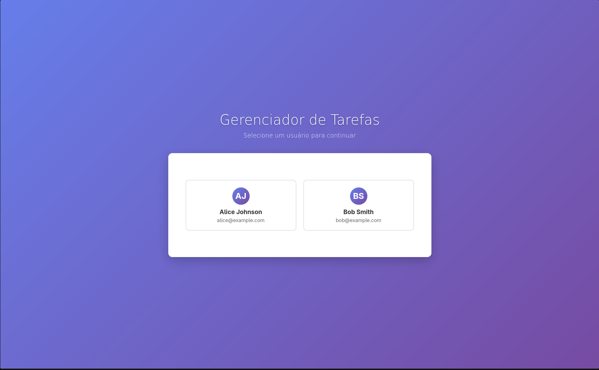
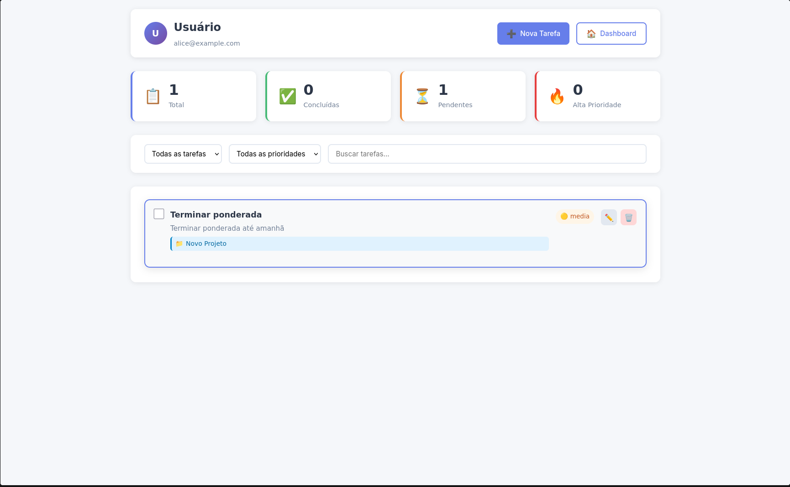
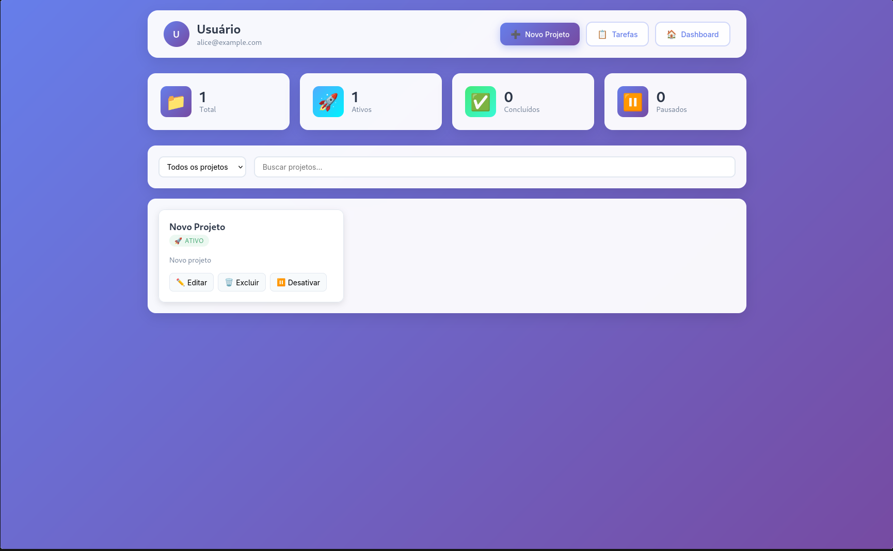

# 📋 Gerenciador de Tarefas

Um sistema simples de gerenciamento de tarefas (To-do list) desenvolvido com JavaScript no frontend, Node.js no backend e banco de dados PostgreSQL via Supabase.

## 🚀 Funcionalidades

- ✅ Criar, ler, atualizar e deletar tarefas
- 🕒 Marcar tarefas como concluídas ou pendentes
- 🔍 Filtrar tarefas por status
- 🔒 Autenticação de usuários com Supabase

## 🛠️ Tecnologias Utilizadas

- **Frontend:** HTML, CSS, JavaScript, EJS (template engine)
- **Backend:** Node.js (Express)
- **Banco de Dados:** PostgreSQL (via [Supabase](https://supabase.io))
- **Hospedagem/Serviços:** Supabase Auth e Supabase DB
- **Validação:** Joi
- **Testes:** Jest, Supertest

## 📁 Estrutura de Pastas

```text
gerenciador-de-tarefas/
├── assets/              # Arquivos estáticos como imagens, CSS, JS
├── config/              # Configurações da aplicação
├── controllers/         # Controladores da aplicação
├── documentos/          # Documentação adicional ou arquivos auxiliares
├── models/              # Modelos de dados
├── node_modules/        # Dependências instaladas via npm
├── routes/              # Definições de rotas
├── scripts/             # Scripts auxiliares
├── services/            # Lógica de serviços (ex: comunicação com APIs)
├── tests/               # Testes automatizados
├── views/               # Templates da interface do usuário
├── .env                 # Variáveis de ambiente
├── .env.example
├── .gitignore           # Arquivos e pastas ignorados pelo Git
├── jest.config.js       # Configuração do Jest para testes
├── package-lock.json    # Lockfile do npm
├── package.json         # Configurações e dependências do projeto
├── readme.md            # Documentação do projeto
├── rest.http            # Requisições HTTP para testes
└── server.js            # Arquivo principal do servidor
```

## 📋 Dependências do Projeto

### Dependências de Produção

- **dotenv** (^10.0.0) - Gerenciamento de variáveis de ambiente
- **ejs** (^3.1.10) - Template engine para renderização de views
- **express** (^4.21.2) - Framework web para Node.js
- **joi** (^17.13.3) - Validação de dados
- **pg** (^8.16.0) - Cliente PostgreSQL para Node.js

### Dependências de Desenvolvimento

- **jest** (^27.0.6) - Framework de testes
- **nodemon** (^2.0.22) - Reinicialização automática do servidor durante desenvolvimento
- **supertest** (^6.1.3) - Testes de integração para APIs HTTP

## 📦 Como Rodar o Projeto Localmente

### 1. **Clone o repositório**

```bash
git clone https://github.com/guihassen/gerenciador-de-tarefas
cd gerenciador-de-tarefas
```

### 2. **Instale as dependências**

Certifique-se de que você tem o Node.js instalado. Em seguida, escolha uma das opções abaixo:

#### Instalar todas as dependências :

```bash
npm install
```

#### Instalar as dependências de produção:

```bash
npm install dotenv pg ejs express joi
```

#### Instalar ad dependências de desenvolvimento (opcional):

```bash
npm install jest nodemon supertest
```

### 3. **Configure as variáveis de ambiente**

Crie um arquivo `.env` na raiz do projeto (se ainda não existir) e configure as variáveis de ambiente com os dados do seu banco de dados no Supabase, conforme o exemplo abaixo:

```bash
DB_USER="seu_usuario"
DB_HOST="seu_host"
DB_DATABASE="seu_banco"
DB_PASSWORD="sua_senha"
DB_PORT="sua_porta"
DB_SSL="true"
PORT=3000
```

### 4. **Execute o script de inicialização do banco de dados**

Certifique-se de que o banco de dados PostgreSQL está configurado e rodando. Depois, execute o script SQL para criar as tabelas:

```bash
npm run init-db
```

ou

```bash
node scripts/runSQLScript.js
```

### 5. **Inicie o servidor**

Para desenvolvimento (com auto-reload):

```bash
npm run dev
```

Para produção:

```bash
npm start
```

### 6. **Acesse a aplicação**

Abra o navegador e acesse:

```bash
http://localhost:3000
```

### 7. **Testes (opcional)**

Para rodar os testes:

```bash
npm test
```

Para rodar os testes com coverage:

```bash
npm run test:coverage
```

## 🎯 Scripts Disponíveis

- `npm start` - Inicia o servidor em modo produção
- `npm run dev` - Inicia o servidor em modo desenvolvimento com nodemon
- `npm test` - Executa os testes
- `npm run test:coverage` - Executa os testes com relatório de cobertura
- `npm run init-db` - Inicializa o banco de dados
- `npm run migration` - Executa migrações do banco de dados

## Demonstração






**Links Explicativos**

-Link Video Demonstrativo: https://youtu.be/Ce6tmFRiK5o

-Link Video Explicativo do código e estrutura: https://youtu.be/e2LrGWlYV0g

## 📝 Licença

Este projeto está sob a licença ISC.

## 🔗 Links Úteis

- [Repositório no GitHub](https://github.com/guihassen/gerenciador-de-tarefas)
- [Issues/Bugs](https://github.com/guihassen/gerenciador-de-tarefas/issues)
- [Supabase](https://supabase.io)
